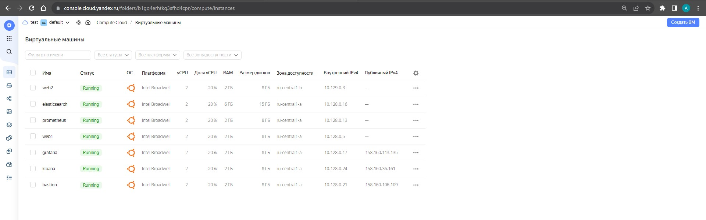
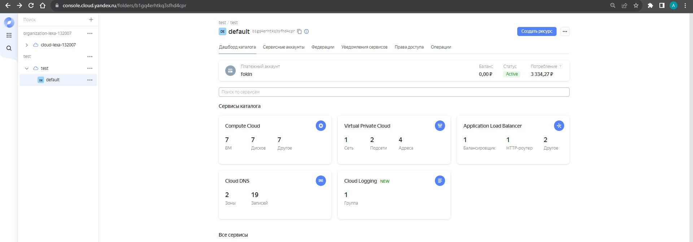
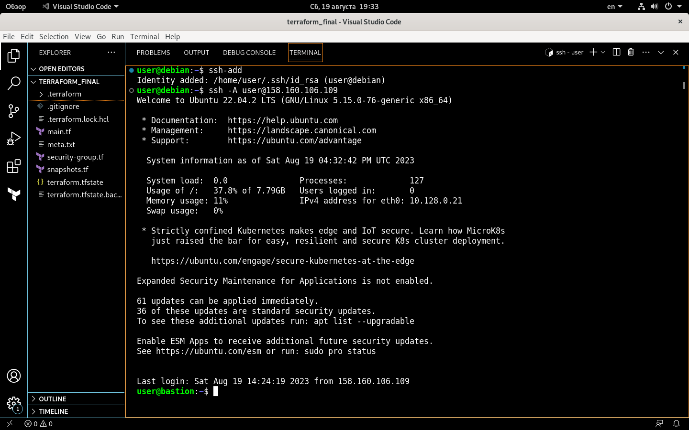
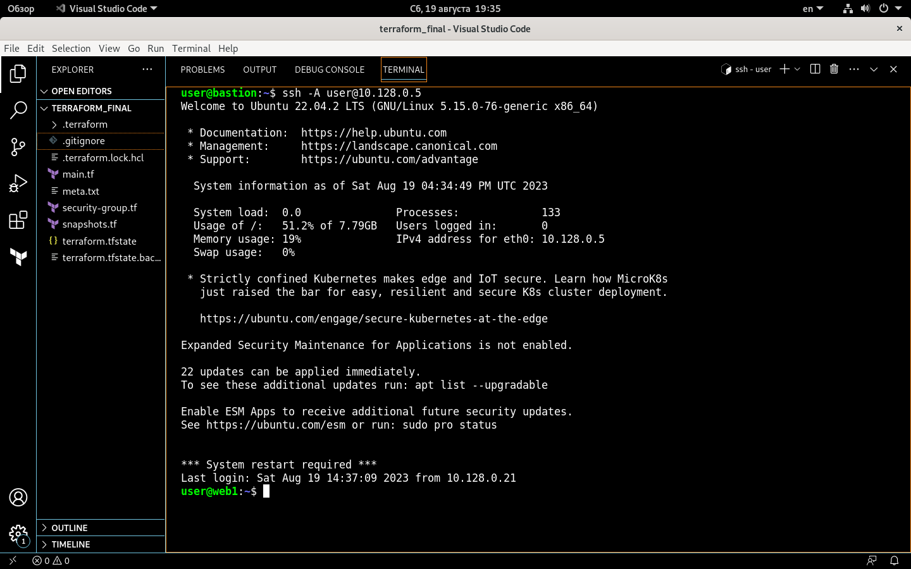
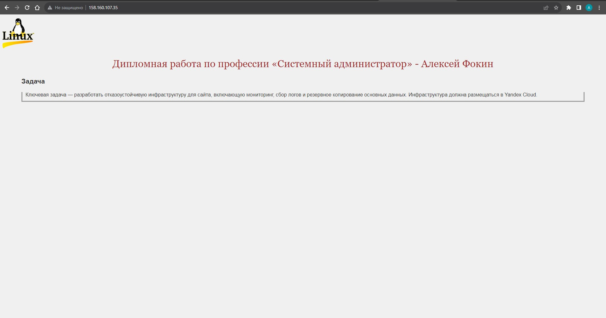
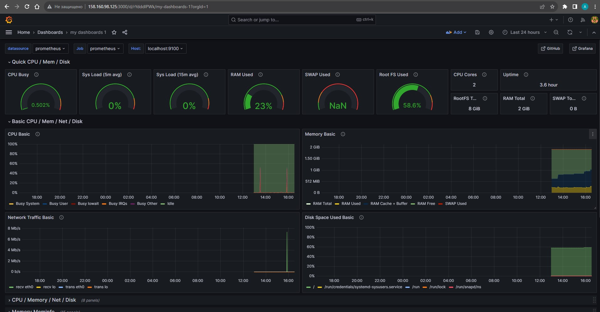
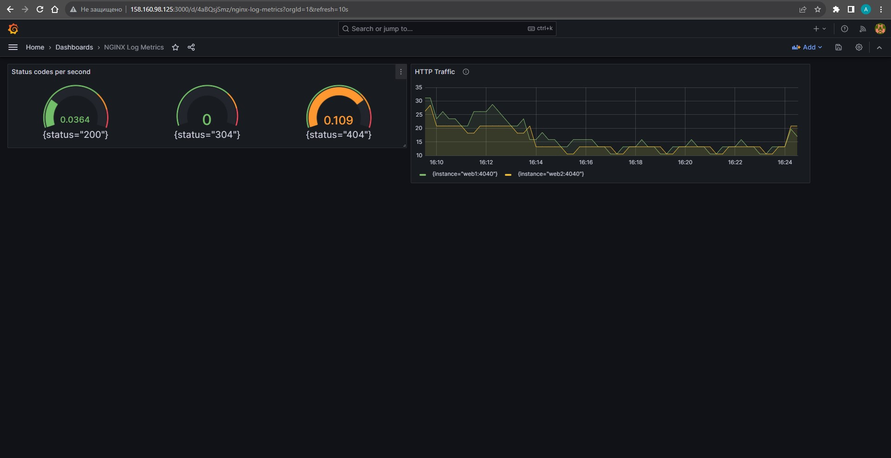
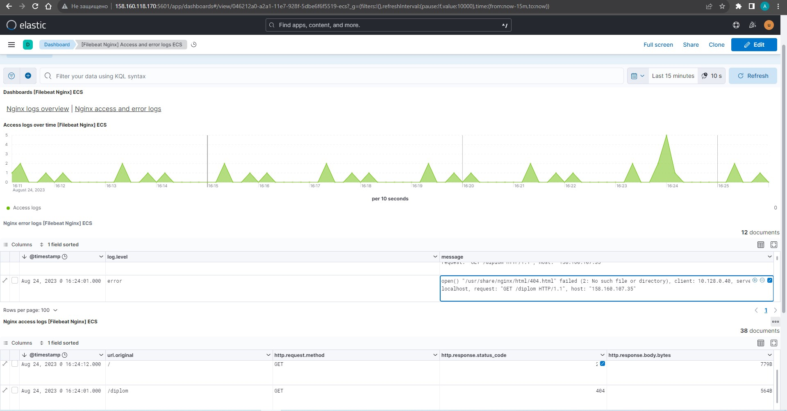

#  Дипломная работа по профессии «Системный администратор» - Алексей Фокин

---------
## Задача
Ключевая задача — разработать отказоустойчивую инфраструктуру для сайта, включающую мониторинг, сбор логов и резервное копирование основных данных. Инфраструктура должна размещаться в [Yandex Cloud](https://cloud.yandex.com/).

## Выполнение работы

### Инфраструктура

Сервера и инфраструктура в  [Yandex Cloud](https://cloud.yandex.com/) создана при помощи terraform и ansible. Операционной системой для виртуальных машин выбрана Ubuntu 22.04 LTS.

### Terraform

##### 1. При помощи terraform разворачиваем сервера.

Все конфигурационные файлы terraform ниже.

 [terraform](terraform_final)

В облаке развертываются виртуальные машины:

web1, web2, prometheus, grafana, elasticsearch, kibana, bastion.

 
 

 ##### 2. Для доступа на наши сервера используем сервер bastion.

 Пробрасываем им ключи доступа.

### Ansible

Устанавливаем ansible создаем фаил [ansible.cfg](ansible_final/ansible.cfg), [inventory.ini](ansible_final/inventory.ini), пишем playbook.

#### 3. Сайт

Запускаем первый playbook: [nginx-playbook.yml](ansible_final/nginx-playbook.yml) который развернет на хостах web1 и web2 - web сервер nginx c сайтом.

[Сайт](http://158.160.107.35)

Адрес балансировщика

http://158.160.107.35

___

 
 Запускаем второй playbook: [playbook.yml](ansible_final/playbook.yml) который устанавливает:

 1. Резопзиторий с зеркалом для установки стека ELK - на хостах web1, web2, elasticsearch, kibana.
 2. На хостах web1 web2 - filebeat, Node-exporter, Nginx Log Exporter
 3. На хосте prometheus - prometheus, node-exporter.
 4. На хосте grafana - grafana.

 ___

 #### 3. Мониторинг

[Ссылка на Grafana](http://158.160.98.125:3000)

http://158.160.98.125:3000

login: admin

password: 123456789

### 4. Логи

Запускаем третий playbook: [elk-playbook.yml](ansible_final/elk-playbook.yml) который устанавливает:

1. На хосте elasticsearch - elasticsearch.
2. На хосте kibana - kibana
3. На хостах web1 и web2 включает модуль nginx и конфигурирует filebeat

[Ссылка на Kibana](http://158.160.118.170:5601)

http://158.160.118.170:5601

login: userl

password: 123456789

  

